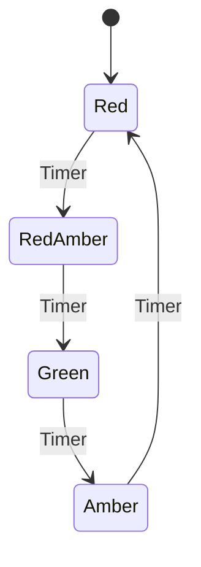

<!--
module_id: isr
author:   David Croft
email:    david.croft@warwick.ac.uk
version: 0.0.1

language: en
narrator: UK English Female

mode: Textbook

title: Interrupt Service Routines
comment:  This module introduces the the concepts of interrupt service routines, and how to implement them in Arduino.
long_description: This module introduces the the concepts of interrupt service routines in Arduino, and how to implement them.
estimated_time_in_minutes: 20


@learning_objectives  
- Understand the concept of interrupt service routines and their importance in embedded systems.
- Learn how to implement basic interrupt service routines in Arduino.
- Gain hands-on experience with using interrupts in Arduino projects.

@end

@style
.flex-container {
    display: flex;
    flex-wrap: wrap; /* Allows the items to wrap as needed */
    align-items: stretch;
    gap: 20px; /* Adds both horizontal and vertical spacing between items */
}

.flex-child { 
    flex: 1;
    margin-right: 20px; /* Adds space between the columns */
}

@media (max-width: 600px) {
    .flex-child {
        flex: 100%; /* Makes the child divs take up the full width on slim devices */
        margin-right: 0; /* Removes the right margin */
    }
}
@end

@version_history 

Previous versions: 

@end

import: https://raw.githubusercontent.com/liaTemplates/AVR8js/main/README.md
import: https://raw.githubusercontent.com/LiaTemplates/mermaid_template/refs/heads/master/README.md

import: ../assets/macros.md
-->


# FSM




### Alternative non-blocking approach

Another way to achieve non-blocking behavior without using interrupts is to use a state machine pattern combined with timing checks.

<div id="statemachine-demo">
    <wokwi-led color="red" pin="13" label="13"></wokwi-led>
    <wokwi-led color="yellow" pin="12" label="12"></wokwi-led>
    <wokwi-led color="green" pin="11" label="11"></wokwi-led>
    <span id="simulation-time"></span>
</div>

```cpp Simple state machine example
const uint8_t redPin = 13;
const uint8_t yellowPin = 12;
const uint8_t greenPin = 11;

enum LightState { RED, RED_AMBER, GREEN, AMBER };

void setup() 
{
    Serial.begin(115200);

    pinMode(redPin, OUTPUT);
    pinMode(yellowPin, OUTPUT);
    pinMode(greenPin, OUTPUT);
}

void loop() 
{
    static const unsigned long stateChangeInterval = 3000;
    static LightState state = RED;

    switch(state) 
    {
        case RED:
            digitalWrite(redPin, HIGH);
            digitalWrite(yellowPin, LOW);
            digitalWrite(greenPin, LOW);
            state = RED_AMBER;
            break;
        case RED_AMBER:
            digitalWrite(redPin, HIGH);
            digitalWrite(yellowPin, HIGH);
            digitalWrite(greenPin, LOW);
            state = GREEN;
            break;
        case GREEN:
            digitalWrite(redPin, LOW);
            digitalWrite(yellowPin, LOW);
            digitalWrite(greenPin, HIGH);
            state = AMBER;
            break;
        case AMBER:
            digitalWrite(redPin, LOW);
            digitalWrite(yellowPin, HIGH);
            digitalWrite(greenPin, LOW);
            state = RED;
            break;
    }

    delay(stateChangeInterval);
}
```
@AVR8js.sketch(statemachine-demo)

This approach uses an enumeration to track the LED state explicitly, making the code more readable and easier to extend with additional states.


<div class = "important">
<b style="color: rgb(var(--color-highlight));">Important note</b><br>

State machines and timer-based scheduling and both powerful techniques that can be easily combined to create complex, responsive behavior in embedded systems.

</div>