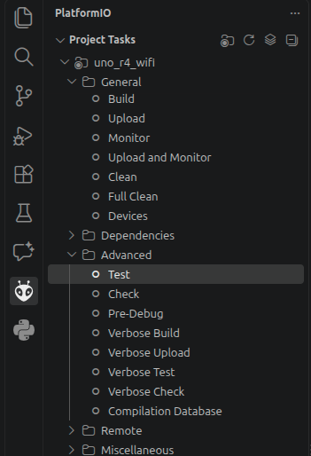

<!--
module_id: unit_testing_unity
author:   David Croft
email:    david.croft@warwick.ac.uk
version: 0.0.1
current_version_description: Initial version
module_type: standard
docs_version: 2.0.0
language: en
narrator: UK English Female
mode: Textbook
title: Unity unit testing
comment:  This module introduces the the concepts of unit testing in C/C++, and how to use the unity framework to create and run tests.
long_description: This module introduces the the concepts of unit testing in C/C++, and how to use the unity framework to create and run tests.
estimated_time_in_minutes: 40

@pre_reqs
Learners should be familiar with basic programming concepts and the C/C++ programming language, including importing modules and using functions. 
@end

@learning_objectives  
- Describe what unit testing is and why it is important in C/C++
- Identify the main components of a C/C++ unit test
- Understand how to use the unity framework to write and run tests
- Understand the steps of the Test Driven Development (TDD) cycle

@end

good_first_module: false
collection: demystifying
coding_required: false
coding_language: c, cpp

@style
.flex-container {
    display: flex;
    flex-wrap: wrap; /* Allows the items to wrap as needed */
    align-items: stretch;
    gap: 20px; /* Adds both horizontal and vertical spacing between items */
}

.flex-child { 
    flex: 1;
    margin-right: 20px; /* Adds space between the columns */
}

@media (max-width: 600px) {
    .flex-child {
        flex: 100%; /* Makes the child divs take up the full width on slim devices */
        margin-right: 0; /* Removes the right margin */
    }
}
@end

@version_history 

Previous versions: 

@end

link:  ../assets/styles.css
import: ../assets/macros.md
import: https://raw.githubusercontent.com/dscroft/CodeRunner/refs/heads/master/README.md

@unittest_fix

@end

@unittest_run

@end
-->


# Unity Unit Testing

@overview


## Unit Testing

Unit testing is a software testing technique where individual units or components of a software are tested in isolation from the rest of the application. The primary goal is to validate that each unit of the software performs as expected.


## What are Test Cases?

Test cases are the building blocks of unit testing. Each test case is a small, focused check that verifies whether a specific part of your code (such as a function or method) behaves as expected under certain conditions. By running test cases, you can quickly identify bugs and ensure your code remains reliable as it evolves.

Test cases typically include:

- **Input data:** The values or objects you provide to the code under test.
- **Expected outcome:** What you anticipate the code should return or how it should behave.
- **Assertions:** Statements that compare the actual outcome to the expected one.


### Why Write Test Cases?

Writing test cases helps you:

- Catch bugs early, before they reach users.
- Document how your code is supposed to work.
- Collaborate with others by providing clear expectations for code behavior.
- Improve code quality and reliability over time.
- Support debugging by isolating issues to specific units of code.
- Encourage better design practices by promoting modular and testable code.
- Save time and effort in the long run by reducing the need for manual testing.
- Build confidence in your codebase, especially when making significant changes or adding new features.
- Ensure compliance with industry standards and regulations that may require thorough testing.
- Provide a safety net for experimenting with new features or optimizations.


## Types of Test Cases in Unit Testing

Unit tests generally fall into two categories:

1. Positive Test Cases

- **Purpose:** Confirm that your code works correctly when given valid, expected inputs.
- **Example:** Testing that `add(2, 3)` returns `5`.

2. Negative Test Cases

- **Purpose:** Check how your code handles invalid or unexpected inputs, such as wrong data types or out-of-range values.
- **Example:** Testing that `divide(10, 0)` raises a `ZeroDivisionError`.

Both types are essential:

- **Positive tests** ensure your code does what it should.
- **Negative tests** ensure your code fails gracefully and securely when things go wrong.


## Characteristics of a Good Test Suite

A test suite is a collection of tests designed to catch errors in your software before it reaches users. 
An effective test suite runs quickly, gives you confidence in your code when all tests pass, and provides helpful feedback when something goes wrong.

A poor test suite, on the other hand, may be slow, fail to inspire confidence even when passing, or provide unhelpful feedback when a bug is detected, making it harder to identify and fix issues.

There are six key characteristics that make a test suite effective. These are:

- **Fast:** Tests should run quickly, so you get feedback without long waits. Fast tests make it easier to run them frequently during development, saving time and improving productivity.
- **Complete:** A complete test suite covers as much of your codebase as possible, catching errors that might arise from changes or new features. Striking a balance between speed and completeness is important.
- **Reliable:** Reliable tests produce consistent results, regardless of changes outside the test’s scope. Flaky tests that fail intermittently can erode trust in your test suite.
- **Isolated:** Each test should run independently, without affecting others. This often means cleaning up any data or state changes after each test, so tests don’t interfere with one another.
- **Maintainable:** A maintainable test suite is easy to update as your code evolves. You should be able to add, modify, or remove tests without difficulty, keeping your suite relevant and effective.
- **Expressive:** Tests should be clear and descriptive, serving as documentation for your code. Well-written tests help others (and your future self) understand what your software is supposed to do.

 By focusing on these qualities, you’ll build test suites that are efficient, trustworthy, and easy to work with as your projects grow.


### Multiple Choice Question

Which of the following best describes a *negative test case*?

[[ ]] A test that checks if the code works with valid inputs.
[[X]] A test that checks if the code handles invalid or unexpected inputs properly.
[[ ]] A test that measures the speed of the code.
[[ ]] A test that checks the code formatting.
****************

<div class = "answer" style = "width: 100%;">

Negative test cases are designed to ensure that the code can handle erroneous or unexpected inputs gracefully, such as raising appropriate exceptions or returning error messages.

</div>

****************


## How to Write Unit Tests for C++ Components

Follow these steps to create effective unit tests in C++:

### 1. Choose a Test Framework

- **Unity:** A lightweight, portable C/C++ testing framework designed specifically for embedded systems and microcontrollers.
- **Catch2:** A modern, feature-rich C++ testing framework with an expressive syntax and minimal boilerplate. Ideal for most C++ projects.
- **GoogleTest:** A widely used C++ testing framework with rich assertions, fixtures, parameterized tests, and death tests.
- **doctest:** A fast, lightweight C++ framework with a simple syntax and minimal compile-time overhead.
- **CppUTest:** A lightweight C/C++ framework that supports mocks and is well suited to embedded and legacy codebases.
- **Boost.Test:** A mature C++ framework integrated with the Boost ecosystem, offering assertions, fixtures, and data-driven tests.
- **CMocka:** A small C framework providing unit testing, mocking, and test isolation for C projects.
- **Criterion:** A modern C testing framework with automatic test discovery, useful assertions, and informative output.

----------------------------------

We will be covering  unity in this guide although it is well worth your investigating Catch2 and other frameworks if you plan on pursuing more general purpose C++ development.

Other languages will have their own frameworks and you should investigate the relevant options for the language/s you are using.

### 2. Organize Your Tests

- Create a new file named `test_{module_name}.cpp` (e.g., `test_math_utils.cpp`).
  - You do not *have* to prefix them with `test_` but it is very much the convention and just general good practise.
- Include the appropriate test framework header (`"unity.h"` for Unity, but e.g. `<catch2/catch_all.hpp>`).
- Include the source module you want to test.

### 3. Write Test Cases

**Unity Example:**

This is a minimal example of a unity test program.

Unit tests should consist of a number of assertions grouped into meaningfully named functions. 
This supplies a degree of structure and readability compared to simply listing hundreds of test assertions without semantic context.

For the full list of assertions, read the [documentation](https://github.com/ThrowTheSwitch/Unity).

```cpp
#include "unity.h"

// ignore setUp and tearDown for now, will discuss later
void setUp(void) {}
void tearDown(void) {}

void test_bigger(void) 
{
    TEST_ASSERT_TRUE(2 > 1);
    TEST_ASSERT_FALSE(1 > 2);
}

void test_equals(void) 
{
    TEST_ASSERT_EQUAL_INT(42, 41+1);
}

int main() 
{
    UNITY_BEGIN();

    // list all test functions
    RUN_TEST(test_bigger);
    RUN_TEST(test_equals);

    return UNITY_END();
}
```
@LIA.evalWithDebug(`["main.cpp", ["unity_internals.h", "assets/unity_internals.h"],["unity.h", "assets/unity.h"],["unity.c", "assets/unity.c"]]`, `g++ --std=c++17 -Wall unity.c main.cpp`, `./a.out`)


<div class = "learn-more">
<b style="color: rgb(var(--color-highlight));">Fail!</b><br>

Try adjusting the test suite to produce a failing assertion and view the resulting test report.
</div>


#### Testing an existing component

**Unity Example:**

In the previous example we were just testing logical statements (i.e. 2>1), not 

The standard structure is to have the code that we wish to test in one file and the test suite in another. 
Structuring the code in this way let's allows us to then use the component being tested in our actual project with no changes (e.g. copy/pasting code) once we are satisfied it works.

```cpp math_utils.h
bool bigger(int a, int b)
{
    return a > b;
}
```
```cpp test_math_utils.cpp
#include "unity.h"
#include "math_utils.h"

void setUp(void) {}
void tearDown(void) {}

void test_bigger(void) 
{
    TEST_ASSERT_TRUE(bigger(5, 3));
}

void test_smaller(void) 
{
    TEST_ASSERT_FALSE(bigger(3,5));
}

int main() 
{
    UNITY_BEGIN();
    RUN_TEST(test_bigger);
    RUN_TEST(test_smaller);
    return UNITY_END();
}
```
@LIA.evalWithDebug(`["math_utils.h", "test_math_utils.cpp", ["unity_internals.h", "assets/unity_internals.h"],["unity.h", "assets/unity.h"],["unity.c", "assets/unity.c"]]`, `g++ --std=c++17 -Wall unity.c test_math_utils.cpp`, `./a.out`)


### 4. Run Your Tests

For your own projects, compile the Unity source file together with the test script and the source code under test. For example, for the C++ test script `test_math_utils.cpp`, run:

```bash
g++ -std=c++17 -Wall unity.c test_math_utils.cpp -o test_math_utils
```

Then run the compiled test executable:

```bash
./test_math_utils
```

For a C test script, use `gcc` instead:

```bash
gcc -std=c11 -Wall unity.c test_math_utils.c -o test_math_utils
./test_math_utils
```

The test script should contain `main`, call `UNITY_BEGIN()`, run each test with `RUN_TEST(...)`, and return `UNITY_END()`. Recompile whenever the test script or code under test changes.

Make sure to make include any necessary header files.

-----------------------------

If your project contains several Unity test scripts, compile each script into a separate executable, or include the test source files in one compilation command. A successful run reports the tests that passed; failed assertions identify the test and source line.

## Unity in PlatformIO

As previously stated, unity is particularly suited to testing of embedded projects. 
This is due to its lightweight nature, so lightweight in fact that it can be compiled for and run on the embedded device itself.
This can be of particular use when attempting to test interaction with embedded hardware specific functionality or interaction with external circuitry.

Doing this within PlatformIO does require some specific steps.

### 1. Specify your unit testing framework

Add a `test_framework` entry to your project configuration (platformio.ini) file.

```
[env]
framework = arduino
test_framework = unity
```

### 2. Create folder structure

Add a `test/` directory to your project root.
Add individual `test_` directories within that and `.ccp` files within those.

**For example**

```txt
project/
├── platformio.ini
├── include/
│   └── math_utils.h
├── src/
│   └── main.cpp
└── test/
    └── test_math_utils
        └── test_math_utils.cpp
```

### 3. Adjust the test runner

We do need to make slight changes to our test runner code.
As our intention is to run this onboard the arduino, it needs to be structured as an Arduino program. 
This means `setup()` and `loop()` functions.

We put the `UNITY_BEGIN` and `UNITY_END` functions within setup instead of loop as we only intend to run the tests once.

```cpp
#include <Arduino.h>
#include <unity.h>
#include "math_utils.h"

void test_bigger(void) 
{
    TEST_ASSERT_TRUE(bigger(5, 3));
}

void test_smaller(void) 
{
    TEST_ASSERT_FALSE(bigger(3,5));
}

void setup() 
{
    delay(2000); // wait to let serial stablise

    UNITY_BEGIN();
    RUN_TEST(test_bigger);
    RUN_TEST(test_smaller);
    UNITY_END();
}

void loop() {}
```

### 4. Run the tests

Run the tests, assuming you are using PlatformIO within VScode there is a "Test" button within the "Advanced" menu of the "PlatformIO" bar on the left.
There is also a PlatformIO "Test" button at the bottom of the window in the shape of a beaker.



----------------------------------------------

Or, even better, PlatformIO should automatically integrate into the VSCode test explorer window on the left hand side.
This provides substantially more control and tracking of individual test results.


----------------------------------------------

If you have multiple directories and test suites within the `test/` subdirectory, then each test suite will be compiled, uploaded to the Arduino and run separately.
You will then get a results summary showing the performance across all tests.


### Multiple Choice Question

What is the main purpose of assertions in a test case?

[[ ]] To print the output of the function.
[[X]] To compare the actual result with the expected result.
[[ ]] To import the module under test.
[[ ]] To document the code.
****************

<div class = "answer" style = "width: 100%;">

Assertions are used to verify that the actual outcome of a function matches the expected outcome.

</div>
****************

### Task 

<div class = "learn-more">
<b style="color: rgb(var(--color-highlight));"></b><br>

Create a new PlatformIO project containing a function that returns the supplied argument doubled.

- Write the appropriate test suite and confirm that it runs successfully on your Arduino.
</div>


## Summary

- Test cases help ensure your code works as intended and handles errors gracefully.
- Use both positive and negative test cases for comprehensive coverage.
- Organize your tests clearly and use assertions to check outcomes.


# Test Driven Development (TDD)

Test Driven Development (TDD) is a software development approach where you write tests before writing the actual code. The process follows a simple cycle known as "Red-Green-Refactor":

1. **Red:** Write a failing test case that defines a function or improvements of a function.
2. **Green:** Write the minimum amount of code necessary to make the test pass.
3. **Refactor:** Clean up the code while keeping the tests green (passing).

This approach helps ensure that your code is well-tested from the start, encourages simple designs, and improves code quality.

## Benefits of TDD

- **Improved Code Quality:** Writing tests first helps clarify requirements and leads to cleaner, more maintainable code.
- **Early Bug Detection:** Since tests are written before the code, bugs are caught early in the development process.
- **Refactoring Confidence:** With a comprehensive test suite, you can refactor code without fear of breaking existing functionality.
- **Better Design:** TDD encourages modular, loosely coupled code, making it easier to extend and maintain.

## TDD Workflow Example

Let's walk through a simple TDD cycle for a function that counts the number of vowels in a string.

``` ascii
             .-----------.  
            (     Red     )  
             '-----------'
            ^             \
           /               \
          /                 \
         /                   V
   .-----------.        .-----------.  
  (  Refactor   ) <----(    Green    )  
   '-----------'        '-----------'
```


### 1. Red Phase

Write a failing tests that defines the desired functionality.

In this case we want to count the number of vowels in a string.

```cpp test_myvowels.cpp
#include <Arduino.h>
#include <unity.h>
#include "myvowels.h"

void test_consonants(void) 
{
    TEST_ASSERT_EQUAL(count_vowels("rythmn"), 0);
}

void test_all_vowels(void) 
{
    TEST_ASSERT_EQUAL(count_vowels("aeiou"), 5);
}

void setup() 
{
    delay(2000);

    UNITY_BEGIN();
    RUN_TEST(test_consonants);
    RUN_TEST(test_all_vowels);
    UNITY_END();
}

void loop() {}
```

At this point, running the tests will fail because `count_vowels` does not exist yet.
But make sure to run the tests to confirm they fail as expected.


### 2. Green Phase

Write the minimum code to pass the tests.

```cpp myvowels.h
#include <Arduino.h>

int count_vowels(String value)
{
    int count = 0;
    for( char c : value )
    {
        if( value == 'a' || value == 'e' || value == 'i' || value == 'o' || value == 'u' ) 
            count += 1;
    }    
    return count;
}
```

**Run the tests again**

Now, running the tests should pass.
If the tests do not pass, adjust the implementation until they do.

<div class = "important">
<b style="color: rgb(var(--color-highlight));">Assumptions make an ass</b><br>

Importantly, the tests help define the requirements for the function. 
So definitive decisions about how the function should behave are made before the implementation is written, i.e. does 'y' count as a vowel?
</div>


### 3. Refactor

Review your code for improvements. 
In this simple case, the function is quite straightforward but there are alternative ways to write it.
This approach for example might be clearer.

```cpp myvowels.h
#include <Arduino.h>

int count_vowels(String value)
{
    int count = 0;
    for( auto c : value )
    {
        switch( c )
        {
            case 'a': [[fallthrough]]
            case 'e': [[fallthrough]]
            case 'i': [[fallthrough]]
            case 'o': [[fallthrough]]
            case 'u': 
                ++count;
                break;
            default:
                break;
        }
    }

    return count;
}
```

**Run the tests again**


### 4. Red Phase (again)

We want to expand the functionality of our function so that it can handle uppercase letters as well.
So we write more failing tests covering this new functionality.

```cpp test_myvowels.cpp
#include <Arduino.h>
#include <unity.h>
#include "myvowels.h"

void test_consonants(void) 
{
    TEST_ASSERT_EQUAL(count_vowels("rythmn"), 0);
}

void test_all_vowels(void) 
{
    TEST_ASSERT_EQUAL(count_vowels("aeiou"), 5);
}

void test_uppercase_consonants(void)
{
    TEST_ASSERT_EQUAL(count_vowels("RHYTHM"), 0);
}
    
void test_uppercase_vowels(void)
{
    TEST_ASSERT_EQUAL(count_vowels("AEIOU"), 5);
}

void test_mixed_case(void)
{
    TEST_ASSERT_EQUAL(count_vowels("An example sentence"), 7);
}

void setup() 
{
    delay(2000);

    UNITY_BEGIN();
    RUN_TEST(test_consonants);
    RUN_TEST(test_all_vowels);
    RUN_TEST(test_uppercase_consonants);
    RUN_TEST(test_uppercase_vowels);
    RUN_TEST(test_mixed_case);
    UNITY_END();
}

void loop() {}
```

**Make sure to run the tests to confirm they fail as expected.**


<div class = "important">
<b style="color: rgb(var(--color-highlight));">Important note</b><br>

It is important that your tests should fail in the Red phase.

Failing tests demonstrate that the tests *can* fail. As such, when they pass, it is evidence that the code is working as intended.
If the tests pass by default, are they actually testing your code or do they just pass no matter what?

</div>


### 5. Green Phase (again)

Write the minimum code to pass the new tests.

```cpp myvowels.h
#include <Arduino.h>

int count_vowels(String value)
{
    int count = 0;
    for( auto c : value )
    {
        switch( tolower(c) ) // notice the tolower function on this line
        {
            case 'a': [[fallthrough]]
            case 'e': [[fallthrough]]
            case 'i': [[fallthrough]]
            case 'o': [[fallthrough]]
            case 'u': 
                ++count;
                break;
            default:
                break;
        }
    }

    return count;
}
```

**Check that the tests pass**

@unittest_run

If the tests do not pass, adjust the implementation until they do.


### 6. Refactor (again)

Our previous implementation was quite clear already but rather verbose we can make it substantially more compact and still clear if we use the `.indexOf` method combined with a list of the characters we are interested in.

```cpp myvowels.h
int count_vowels(String value)
{
    const String vowels = "aeiou";
    int count = 0;
    for( char c : value )
        if( vowels.indexOf(c) != -1 )
            ++count;
    return count;
}
```

**Make sure to run the tests again to confirm they still pass.**

------------------------

We can continue this cycle, adding more tests and functionality as needed.


## TDD Best Practices

- Write small, focused tests for each piece of functionality.
- Only write enough code to make the test pass.
- Refactor regularly to keep code clean.
- Use descriptive test names to clarify intent.


### Multiple Choice Question

What is the first step in the TDD cycle?

[[ ]] Write the implementation code.
[[ ]] Refactor the code.
[[X]] Write a failing test.
[[ ]] Deploy the application.
***************

<div class = "answer" style = "width: 100%;">

~~Test~~ Driven Development always starts with creating the tests first and ensuring they fail.

</div>

***************
Which step of the TDD cycle is focused on writing the smallest amount of code necessary to make the failing test pass?

[[ ]] Red.  
[[X]] Green.  
[[ ]] Refactor.  
[[ ]] Deploy.  
***************

<div class = "answer" style = "width: 100%;">

The Green phase is where you write the minimal implementation required to satisfy the failing test, keeping changes small and focused.

</div>
***************

***************
Which step of the TDD cycle is focused on writing the smallest amount of code necessary to make the failing test pass?

[[ ]] Red.  
[[X]] Green.  
[[ ]] Refactor.  
[[ ]] Deploy.  
***************

<div class = "answer" style = "width: 100%;">

The Green phase is where you write the minimal implementation required to satisfy the failing test, keeping changes small and focused.

</div>
***************


## Additional Resources

* [python.org](https://www.python.org/) is a great resource for documentation, FAQs, and tutorials for beginners, as well as information about what is happening in the wider Python community. Check it out and explore!

* If you're interested in practicing more with Google Colab, check out [this notebook looking at statistics](https://colab.research.google.com/drive/1zkW5Y0SoV3gMU6sQtlgnZsfR2GIXi6F_?usp=sharing).

* If you are ready to actually write some Python code, check out the [Python Basics: Functions, Methods, and Variables](https://liascript.github.io/course/?https://raw.githubusercontent.com/arcus/education_modules/main/python_basics_variables_functions_methods/python_basics_variables_functions_methods.md#1) module.


## Recap

@recap
